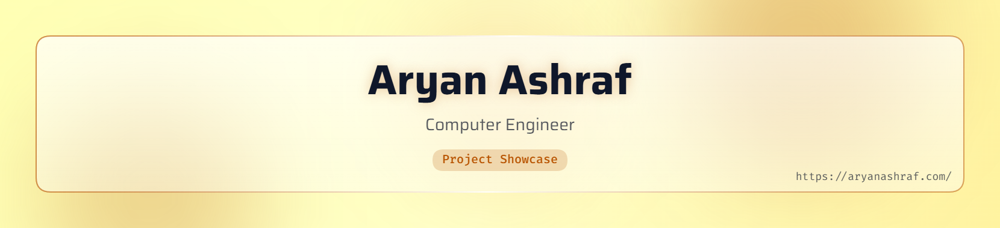

<!-- ===================== HEADER ===================== -->
<picture>
  <source media="(prefers-color-scheme: dark)" srcset="art/header-dark.png">
  
</picture>

<h1 align="center">Hey there, I'm Aryan 👋</h1>

  

  
  
  

 

<!-- ===================== ABOUT ===================== -->
<h2 align="center">About Me</h2>

🎓 4th year **Computer Engineering** student at the **University of Guelph** (co-op, graduating April 2028)

💼 **Software Developer** co-op at **Brock Solutions** in the SmartSort group, working on React/TypeScript, .NET and multi-agent LLM systems with RAG

🔬 Previously a **Research Assistant in ML and Assistive Devices** at Guelph (VR mirror therapy, rehab-glove firmware)

🌉 Co-building **Bridge**, a hackathon donation app that's growing into an early-stage startup

🤖 Member of the **UofG Robotics Team**, working on rover control over C++ UDP and CAN bus

🎯 Looking for **Summer 2027 SWE internships** in Canada and the US

📍 Guelph, Ontario

 

<!-- ===================== TECH STACK ===================== -->
<h2 align="center">Tech Stack</h2>

  <picture>
    <source media="(prefers-color-scheme: dark)" srcset="https://skillicons.dev/icons?i=ts,js,py,cs,java,c,cpp,html,css,react,vite,tailwind,dotnet,fastapi,pytorch,tensorflow,unity,arduino,azure,gcp,firebase,docker,linux,git,github&perline=9&theme=dark">
    
  </picture>

 

<!-- ===================== FEATURED PROJECTS ===================== -->
<h2 align="center">Featured Projects</h2>

<table align="center">
  <tr>
    <td width="50%" valign="top">

### 🌉 [Bridge](https://github.com/Aryan-a-a/Bridge)
Peer-to-peer food and clothing donation platform built at GDG Hacks, now an early-stage startup. Snap a photo and Gemini Vision turns it into an item list, then volunteer drivers deliver with live tracking and in-app chat.

`React` `TypeScript` `FastAPI` `Firestore` `Cloud Run` `Gemini Vision`

[Live demo](https://helper-495902.web.app)

    </td>
    <td width="50%" valign="top">

### ✋ [ASL Detection](https://github.com/Aryan-a-a/ASL-Detection-Program)
Real-time American Sign Language detection from a live video feed, classifying 10 signs at 85%+ accuracy. Trained on a 1,500-image dataset I labelled with LabelImg.

`Python` `PyTorch` `TensorFlow` `YOLOv8` `Jupyter`

    </td>
  </tr>
  <tr>
    <td colspan="2" align="center" valign="top">

### 🌐 [Portfolio](https://github.com/Aryan-a-a/Aryan-a-a.github.io)
Single-page personal site in plain HTML and CSS. No frameworks, no build step, built to WCAG 2.1 AA.

`HTML` `CSS`

[Visit aryanashraf.com](https://aryanashraf.com)

    </td>
  </tr>
</table>

 

<!-- ===================== STATS ===================== -->
<h2 align="center">GitHub Activity</h2>

  <picture>
    <source media="(prefers-color-scheme: dark)" srcset="https://streak-stats.demolab.com?user=Aryan-a-a&background=1C0C00&border=C77A3A&stroke=5D3310&ring=F59E42&fire=F59E42&currStreakNum=FFFFFF&sideNums=FFFFFF&currStreakLabel=F59E42&sideLabels=FDE7C4&dates=C9A27E&border_radius=12">
    
  </picture>

<!-- ===================== SNAKE ===================== -->
<!-- The snake SVGs are generated by .github/workflows/snake.yml every 12 hours
     and pushed to the "output" branch. Run the workflow once after the first push. -->

  <picture>
    <source media="(prefers-color-scheme: dark)" srcset="https://raw.githubusercontent.com/Aryan-a-a/Aryan-a-a/output/snake-dark.svg">
    
  </picture>

 

<!-- ===================== CONNECT ===================== -->
<h2 align="center">Let's Connect</h2>

  
  
  

<!-- ===================== FOOTER ===================== -->

